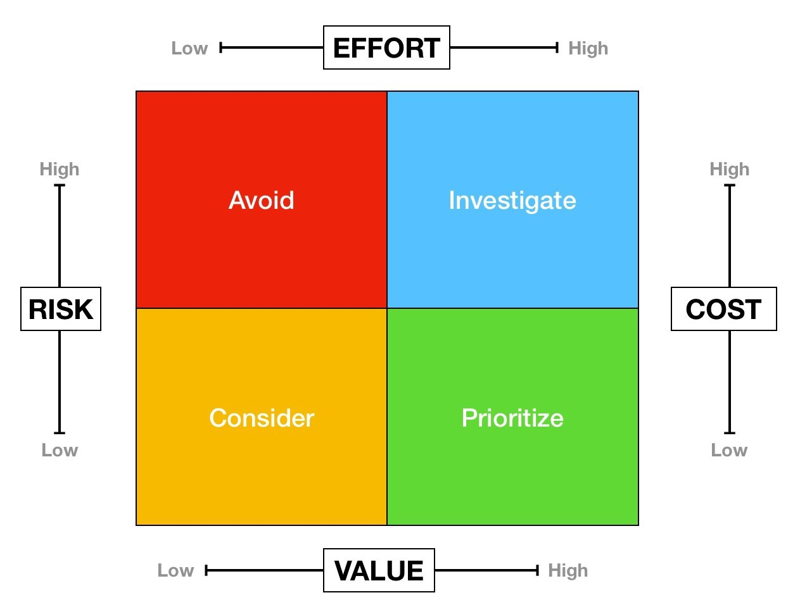

## Product management tools

### Product Board

### Click up
## Prioritization tools

### Eisenhower matrix

**Value vs. Effort**

* Value vs. Risk
* Value vs. Cost
* ICE (impact * confidence * ease; 1-10 each)

### RICE scoring

* reach - how many people will notice the change
* impact
* confidence
* effort

### Other technics

#### Kano model (Noraki Kano)

* basic
* expected
* attractive

#### MoSCoW 
- must - should - could - would

## Buy a Feature

* Gaming
* Play money (1/3 of all cost)
* Explain

## Feature Bucket**

## KJ method**

## References

[Product Board](https://support.productboard.com/hc/en-us/articles/360056294114-6-Roadmap-Communicate-your-plan)