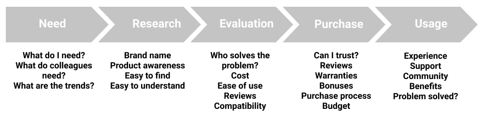
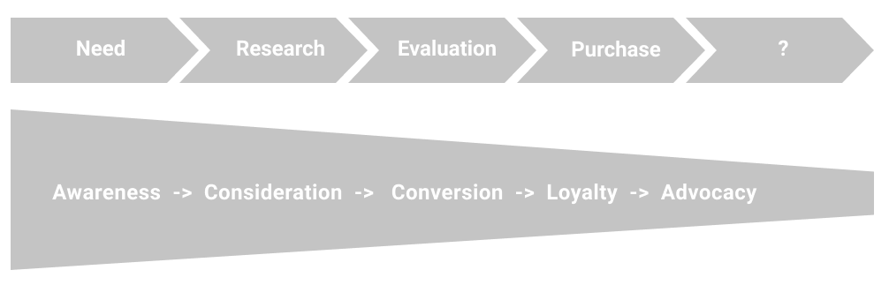
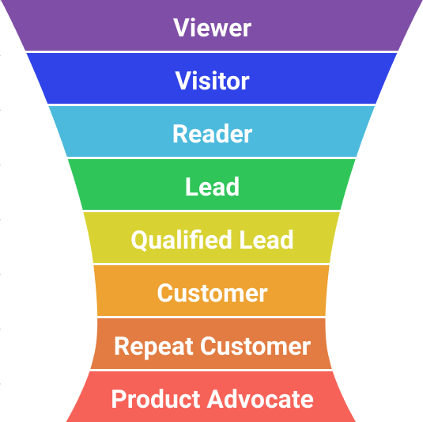

It takes a lot of effort before you gain a new customer. It is usually several interactions. So it is usually described as a journey. On every interaction customers need to find different content. They have different concern before sale, during sale negotiation, and when purchase was made.
To increase probability of accompany customers through the whole funnel, it is good to understand the stage, use appropriate tools to bring customer to the interaction and to the next stage. 

## Journeys

At each stage it is good to offer answers to specific questions. In the right order and at the right time. There are serveral stages which your prospects can go through. Typical stages can be like that:

1. Unaware
2. Awareness
3. Consideration
4. Evaluation
5. Purchase
6. Post-purchase
7. Advocacy

Image by author

Not all potential customers go the whole journey. Sometimes they need other product, sometimes they do not find important information, sometimes some other problem occurs. 

Image by author

## Digital marketing funnel

### Task and Metrics

    <table>
    <tr>
        <th>Funnel</th>
        <th>Goal</th>
        <th>Journey</th>
        <th>Tasks</th>
        <th>Metric</th>
    </tr>
    <tr class="tr-fix">
        <td style="background-color: darkviolet; color: white;">TOFU</td>
        <td class="grey">Awareness</td>
        <td>Viewer</td>
        <td>SEO, Ads, Trends, Blog, Video, Images</td>
        <td>Average position, CTR</td>
    </tr>
    <tr class="tr-fix">
        <td rowspan="3" style="background-color: #2FC559; color: white;">MOFU</td>
        <td rowspan="2" class="grey">Consideration</td>
        <td>Visitor</td>
        <td>Landing pages, What-Why-Trust-CTA</td>
        <td>Bounce rate</td>
    </tr>
    <tr class="tr-fix">
        <td>Reader</td>
        <td>Content, Video tutorials, Customer stories</td>
        <td>Time on page</td>
    </tr>
    <tr class="tr-fix">
        <td rowspan="2" class="grey">Conversion</td>
        <td>Lead</td>
        <td>Download, Trial page</td>
        <td>Conversion rate</td>
    </tr>
    <tr class="tr-fix">
        <td rowspan="4" style="background-color: #E27C42; color: white;">BOFU</td>
        <td>Qualified Lead</td>
        <td>Support, UI, tutorials</td>
        <td>CES, </td>
    </tr>
    <tr class="tr-fix">
        <td rowspan="2" class="grey">Loyalty</td>
        <td>Customer</td>
        <td>Support, Solve the problem</td>
        <td>New customers</td>
    </tr>
    <tr class="tr-fix">
        <td>Repeat Customer</td>
        <td>UX, Comunication, Loyalty offers, FAQs, Support, Forums </td>
        <td>Churn ratio, CSAT</td>
    </tr>
    <tr class="tr-fix">
        <td class="grey">Advocacy</td>
        <td>Advocate</td>
        <td>Comunication, Loyalty offers, FAQs, Support, Forums, Brand, Social media</td>
        <td>Reviews, NPS</td>
    </tr>
    </table>

    

### Tasks and Tools

    <table>
    <tr>
        <th>Funnel</th>
        <th>Goal</th>
        <th>Journey</th>
        <th>Tasks</th>
        <th>Tools</th>
    </tr>
    <tr class="tr-fix">
        <td style="background-color: darkviolet; color: white;">TOFU</td>
        <td class="grey">Awareness</td>
        <td>Viewer</td>
        <td>Attract: SEO, Ads, Trends, Blog, Video, Images</td>
        <td>SemRush, GA, GSC</td>
    </tr>
    <tr class="tr-fix">
        <td rowspan="3" style="background-color: #2FC559; color: white;">MOFU</td>
        <td rowspan="2" class="grey">Consideration</td>
        <td>Visitor</td>
        <td>Engage: Landing pages, What-Why-Trust-CTA</td>
        <td>GA, FM, Smartlook, Hotjar; Capterra, G2; Product Board</td>
    </tr>
    <tr class="tr-fix">
        <td>Reader</td>
        <td>Engage: Content, Video tutorials, Customer stories</td>
        <td>Camtasia, Figma, Language tool, Hemingway</td>
    </tr>
    <tr class="tr-fix">
        <td rowspan="2" class="grey">Conversion</td>
        <td>Lead</td>
        <td>Persuade to: Download, Request Trial</td>
        <td>Freshedesk</td>
    </tr>
    <tr class="tr-fix">
        <td rowspan="4" style="background-color: #E27C42; color: white;">BOFU</td>
        <td>Qualified Lead</td>
        <td>Persudade to buy: Support, UI, tutorials</td>
        <td>Freshdesk, Product Board</td>
    </tr>
    <tr class="tr-fix">
        <td rowspan="2" class="grey">Loyalty</td>
        <td>Customer</td>
        <td>Retain: Support, Solve the problem</td>
        <td>Freshdesk, Product Board</td>
    </tr>
    <tr class="tr-fix">
        <td>Repeat Customer</td>
        <td>Retain: UX, Comunication, Loyalty offers, FAQs, Support, Forums </td>
        <td>Freshdesk, Product Board</td>
    </tr>
    <tr class="tr-fix">
        <td class="grey">Advocacy</td>
        <td>Advocate</td>
        <td>Promote: Comunication, Loyalty offers, FAQs, Support, Forums, Brand, Social media</td>
        <td>Freshdesk, Product Board</td>
    </tr>
    </table>

   

## Sources of inspiration

<a href="https://coolerinsights.com/2017/04/content-marketing-buyers-journey/" target="_blank">Custome journeys - Cooler Insight</a>
