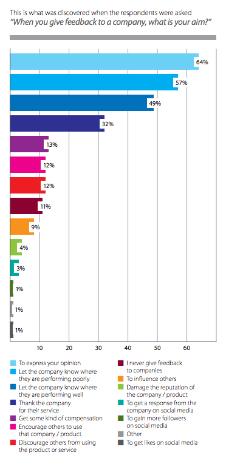

## Why their opinion matters

- Who brings the money?
- Best possible experience for prospects and 
- customers.
- Opinion from outside
- Learn the trends
- How to improve products and services

## Why do they give feedback?

According to a whitepaper by TFM&A Insights, most customers give feedback because they want to express their opinion (64%). More specifically, they do so to let companies know where they were doing poorly (57%) or well (49%)

## Why they don't want to give you feedback

[Johan Leitner](https://www.touchwork.com/the-top-5-reasons-your-customers-dont-provide-feedback/) discuss these main reason:
The wrong design
- too long, (try two to three questions)
- unclear purpose
- too personal
- doesn't match the experience
They think you don't care
- lack of customer care during product usage
They don't know what you're using it for
It's too late
Broad questions and no personalization

Timing https://customerthink.com/why-you-need-to-capture-customer-feedback-in-real-time-and-how-to-do-it-in-brick-and-mortar-businesses/

## What to do about it

Make them feel important

Keep them involved, invite them to your project. Make them a part of your company’s growth story

Use the nature customer interaction

When they are emotionally connected

When you do something extraordinary

>&#128161; **Example:** You offer a trial period for your product. You can offer extending your trial. When you ask for a feedback when extending, you increase probability of receiving an opinion from a customer who has been given something special.

How they found you

Buyer personas

## Target group

### Web visitors

### Evaluators

### New customers

### Active

### Renewing?

### Loyal customers

### Brand advocates

## Methods

- On-site activity
- Instant feedback from the website (link, live chat)
- Feedback surveys
- Social media
- Email forms
- Usability tests
- Exploratory customer interviews
- Customer review
- Support follow up

## Techniques

- CES
- CSAT
- NPS
- 5 Whys

## Recommendations

- keep it short
- show them their opinion matters
- make them feel important (they are)
- ask only question you are going to use
- do not be too personal
- use the information
- sort it, interpret it properly
- offer something in return
https://adoric.com/blog/customer-feedback/

## Sources
1. https://www.touchwork.com/the-top-5-reasons-your-customers-dont-provide-feedback/
2. https://kayako.com/blog/the-proper-way-to-ask-for-customer-feedback/
3. https://www.optimonk.com/15-ways-e-commerce-websites-get-customer-feedback/
4. https://www.helpscout.com/blog/customer-feedback/
5. https://www.hotjar.com/blog/customer-feedback/
6. https://neilpatel.com/blog/best-ways-to-get-feedback/
7. https://customerthink.com/why-you-need-to-capture-customer-feedback-in-real-time-and-how-to-do-it-in-brick-and-mortar-businesses/
8. Psychology of survey response 
