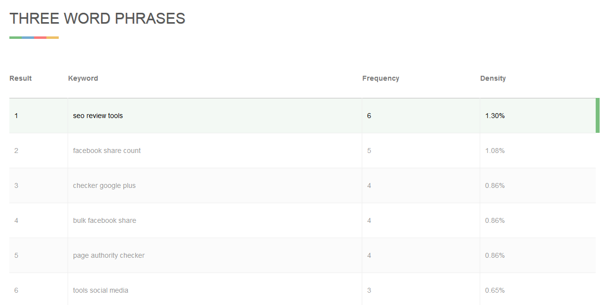
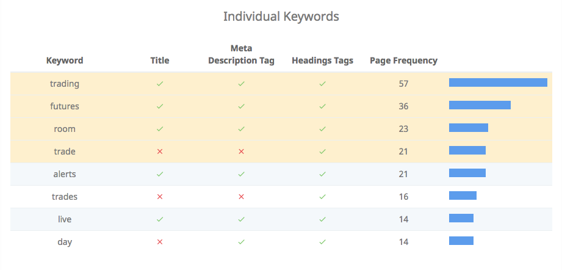

## Why is keyword analysis important?

Let's say you have an interesting content and you what to let it know to your target audience. What to do to help them to find you?

### Target audience, keywords, and channels
Study your audience, competitors, their content, and channels they use.

1. Keyword gap analysis. Use a tool to compare key competitors. For example semRush. Select high volume relevant keywords.
1. Analyze what works for you. Open your Gooogle Search Console and find keywords with high impression, good average position, and potentially reasonable click through rate. Put them on the list.
1. Make the list

### Popular on page metrics
* Density (% of keywords in indexable text) - Google no longer uses (2014)
* Frequency (frequent, but avoid stuffing)
* Prominence (keep it in the beginning)
* Proximity (keep keywords close)

> **How to calculate density**
> Density = ( Nkr / ( Tkn -( Nkr * ( Nwp-1 ) ) ) ) * 100
> 
> Density = your keyword density  
> Nkr = how many times a specific keyword is repeated  
> Nwp = number of words in the phrase  
> Tkn =  total words in the analyzed text   

#### Example of keyword density and frequency calculation

<small>Source: https://www.seoreviewtools.com/keyword-density-checker/ with page https://developers.google.com/search/docs/beginner/do-i-need-seo</small>

### General ideas
- Keywords in the title
- Keywords int the description
- Keywords in the H1 tag
- Variation of the keywords throughout the text
- Make it sound natural and keep it readable

#### Keyword consistency approach
Put top volume relevant keywords consistently to key elements.

<small>Example from https://www.seoptimer.com/blog/keyword-consistency/</small>

## Keep it readable!

## Tools summary

### General
1. https://search.google.com/search-console
2. https://keywordfinder.io/
3. https://www.semrush.com/
4. https://freetools.seobility.net/
5. https://www.seoptimer.com/

### Density
1. https://www.seoreviewtools.com/keyword-density-checker/

### Consistency
1. https://www.seoptimer.com/blog/keyword-consistency

### Readability
1. https://hemingwayapp.com/
2. https://seoscout.com/tools/keyword-analyzer

## Sources
* https://www.seo.com/blog/say-what-keyword-density-frequency-prominence-proximity/
* https://www.seoptimer.com/blog/keyword-consistency/
