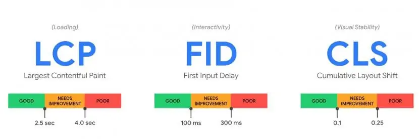

## How to improve SEO in 2021?
It is about the content, social media, SERP features, Google Ads, BERT, E-A-T, and among all about PERFORMANCE.

## What is suppose to change in SEP
1. Content around future customer intents
2. Update. The most important content monthly. Secondary content quarterly. All other content yearly
3. Long form content – images, videos (PAA, PAS)
4. Check CTR (numbers, questions in titles)
5. Accelerated Mobile Pages (AMP) - ranking factor
6. Schema.org strategy
7.  Link building strategy (Review sites, Broken links, Posts, Articles, Partner webs)
8.  Social media
9.  SERP features (less organic CTR in general) – snippets, instant answers, knowledge boxes
10. More aggressive Google Ads (Deliver CTR for advertizers)
11. Brand searches (google ranking, search for more, more direct traffic)
12. BERT and E-A-T – intent; Expertise, Authority, Trustworthiness (author bio, figures sourcing)
13. Videos!
14. Core Web Vitals – Loading, Interactivity, Visual stability | Google update planned for Q2
15. Intent

## Updated SEO Checklist
1. Crawl your website and draw your site architecture.
2. Establish value propositions and visitors' intent for each page.
3. Define your target audience.
4. Add social media strategy.
5. Check your CTRs.
6. Analyze keyword gaps from your competition.
7. Update URLs, page titles, and meta descriptions.
8. Make sure your keyword is in your URL.
9. Track keywords and topics for each page.
10. But don’t keyword stuff.
11. Review and edit page content regularly.
12. Include Shema.org metada.
13. Use pictures, videos.
14. Check page performance
15. Optimize your visual content.
16. Add internal links.
17. Add external links.
18. CTA for every page.
19. Get authority. Sign your articles, include source information.
<!-- ## Selected topics

### 17. Core Web Vitals
Loading
Interaktivita
Stabilita

#### Loading
Largest Contentful Paint
https://web.dev/lcp/

#### Interactivity
First Input Deliverability

#### Visual stability
Cumulative Layout Shift

(Source: Google) -->

## Tool

### General SEO checker
https://freetools.seobility.ne
### SERP features
https://www.semrush.com/
https://alsoasked.com/

### Performance
https://developers.google.com/speed/pagespeed/insights/
https://www.webpagetest.org/

## Resources
https://www.woorank.com/en/blog/google-core-web-vitals  
https://web.dev/lcp/
https://www.searchenginejournal.com/top-free-seo-tools/302553/#close

Image from: <a href='https://www.freepik.com/vectors/computer'>Computer vector created by macrovector - www.freepik.com</a>